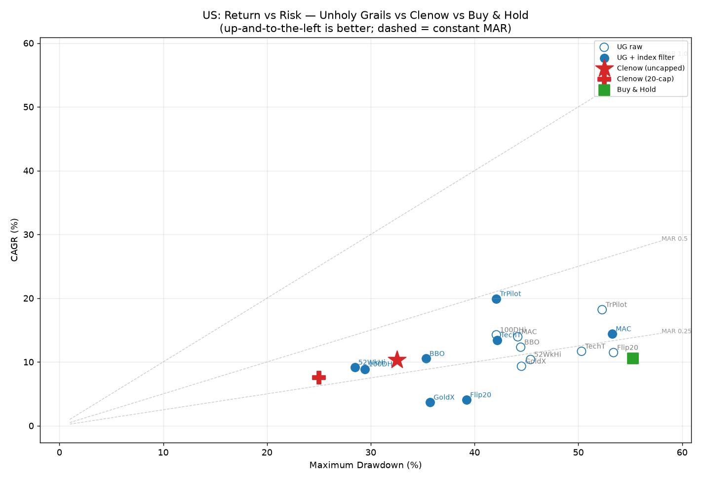

# Unholy Grails — momentum strategies on the S&P 500 & Nifty 500, vs Clenow

A faithful, backtested build of the **eight momentum strategies in Nick Radge's
*Unholy Grails* (2012)** — each in raw and *index-filtered* form — run on the
**S&P 500** and **Nifty 500**, and compared head-to-head with **Andreas Clenow's
"Stocks on the Move"** momentum system on the *identical* survivorship-aware data,
costs and accounting.

> *Unholy Grails* argues that simple, rule-based momentum — buy strength, cut
> weakness, and step aside in bear markets via an index filter — beats Buy & Hold
> on a risk-adjusted basis. This repo tests that claim out-of-sample (the book
> used the ASX, 1997–2011) on two different markets 13+ years later, and asks how
> it stacks up against a more sophisticated cross-sectional momentum system.

---

## TL;DR findings

| | S&P 500 (1996–2026) | Nifty 500 (1998–2026) |
|---|---|---|
| **Buy & Hold** | 10.5% · −55% · MAR 0.19 | 12.6% · −61% · MAR 0.21 (Sensex, full window) |
| **Best Unholy Grails (by MAR)** | TrendPilot+filter 19.9% · −42% · **0.47** | 100-Day High+filter 16.3% · −40% · **0.41** |
| **Clenow — book (uncapped, ~22–31 names)** | 10.3% · −33% · 0.32 | 21.9% · −39% · 0.56 (Sharpe 1.20) |
| **Clenow — 20-position cap (like-for-like)** | 7.6% · −25% · 0.30 | 11.0% · −19% · **0.59 (Sharpe 1.11)** |

1. **The index filter is the single biggest win — confirmed on both markets, decades after
   the book.** A 75-day index filter slashes drawdowns everywhere (52-Week High on Nifty 500:
   **−78% → −34%**; S&P 500: −45% → −28%) and usually lifts MAR. In volatile India it often
   *raises* CAGR too, because dodging the −60% bears protects compounding.
2. **Much of Clenow's headline edge was diversification, not signal.** Clenow's book profile
   is *uncapped* and holds ~22 (US) / ~31 (India) names. Cap it to the same **20 positions**
   as Unholy Grails and its India CAGR collapses **21.9% → 11.0%** — *below* the best filtered
   breakout systems (16%). What survives capping is Clenow's *risk-adjusted smoothness*
   (MAR 0.56–0.59, Sharpe ~1.1–1.2) from volatility-normalised position sizing — a genuine,
   structural edge in high-dispersion India.
3. **In the US the simple book systems win outright.** TrendPilot+filter (MAR 0.47) and
   several filtered breakouts beat *both* Clenow variants (MAR 0.30–0.32) on the calm,
   low-dispersion S&P 500. Sophistication earns its keep only where dispersion is high.
4. **No single strategy wins everywhere.** TrendPilot tops the US but is among the *worst*
   in India (a per-stock 200-day MA whipsaws in Indian volatility). The 20% Flipper's fixed
   thresholds suit neither large-cap market well.
5. **Win rate is irrelevant to profit, exactly as the book claims.** The best systems win
   37–50% of trades; they profit from a high payoff ratio (avg win ≫ avg loss) on long-held
   winners, not from being right often.

Full tables, charts and per-strategy stats: **[RESULTS.md](RESULTS.md)**.



---

## The eight strategies

All are daily, long/cash breakout systems (signal on a close → fill at the next
open). Full rules in **[docs/STRATEGY_SPEC.md](docs/STRATEGY_SPEC.md)**.

| # | Strategy | Entry | Exit |
|---|---|---|---|
| 1 | **52-Week High** | close > 250-day high | close < 250-day low |
| 2 | **100-Day High** | close > 100-day high | close < 100-day low |
| 3 | **TrendPilot** | 5 closes above 200-day SMA | 5 closes below 200-day SMA |
| 4 | **Golden Cross** | 50-day SMA crosses ↑ 200-day | Death Cross (50 ↓ 200) |
| 5 | **Moving Avg Channel** | 5 bars fully above 10/8 MA channel | 5 bars fully below |
| 6 | **TechTrader** | 70-day high + 10-day high + >40-SMA + up-day | 10% stop / 180-day EMA-of-lows |
| 7 | **20% Flipper** | +20% off a swing low | −20% off a swing high |
| 8 | **Bollinger Breakout** | close > 100-SMA + 3σ | close < 100-SMA − 1σ |

Each is also run **with the index filter**: a 75-day SMA on the market index gates
new entries and adds a defensive exit (trailing stop / cash) when the regime is
bearish — the book's key risk-control overlay.

---

## Why this is a *fair* comparison to Clenow

The whole point is apples-to-apples, so Unholy Grails and Clenow share everything
except the trading rule:

- **Same data:** survivorship-aware, dividend/split-adjusted OHLC from the
  [clenowMomentum](.) project's panels — 1,100+ US symbols (incl. delisted names like
  AAMRQ, ABS) and 1,380+ NSE symbols. Adjusted OHLC is derived as `raw × adjClose/close`,
  with a **causal repair** step that fixes corrupt single-day adjustment spikes (a real
  NSE-data hazard — see [docs/STRATEGY_SPEC.md](docs/STRATEGY_SPEC.md) and `src/data.py`).
- **Same point-in-time universe:** index membership from the change-row constituent
  files (`constituentsOn(date)`), so a stock is only tradable while it was actually in
  the index.
- **Same costs & fills:** next-day-open fills; US = 5 bps slippage + \$1/ticket,
  India = 15 bps + ₹20/ticket; sells settle before buys; cash never goes negative.
- **Same accounting:** delisted holdings liquidated at last price (5-day grace), daily
  mark-to-market, closed-episode win/loss.
- **Same metrics:** CAGR (365.25-day years), MaxDD, MAR = CAGR/|MaxDD|, Sharpe
  (rf = 0), exposure, win rate — computed by one function for every system.

The Clenow baseline is the **actual `clenowMomentum` engine** run in-process on the
same window (`src/clenow_baseline.py`), not a re-implementation.

---

## Running it

```bash
python -m venv .venv && source .venv/bin/activate
pip install -r requirements.txt

# Point the configs at your price panels (edit config/us.yaml, config/india.yaml:
#   data_dir, constituents_file, regime_symbol, report_symbol)

python src/run_all.py --market both          # 8 strategies × {raw, filtered} × 2 markets
python src/clenow_baseline.py --market both   # Clenow baseline (needs the clenowMomentum repo)
python src/compare.py                         # tables + charts + RESULTS.md
python src/montecarlo.py --market us --strategy hundred_day_high --variant filtered --runs 50
```

> Price data is **not** committed (large, EODHD/NSE-derived). The loader reads one
> parquet per symbol (`date, open, high, low, close, volume, adjClose`) from `data_dir`
> plus a `date,tickers` change-row constituents file. See `config/*.yaml`.

---

## Repo layout

```
config/         us.yaml, india.yaml   — data paths, costs, benchmarks, window
src/
  data.py       survivorship-aware adjusted-OHLC panel + causal adjustment repair
  universe.py   point-in-time index membership (change-row files)
  indicators.py vectorized Donchian / SMA / EMA / Bollinger / ATR / turnover
  strategies.py the eight strategies as (entry, raw_exit) signal matrices
  engine.py     daily event-driven backtest (accounting mirrors Clenow)
  metrics.py    CAGR / MaxDD / MAR / Sharpe / win / payoff / expectancy
  run_all.py    sweep all strategies × variants × markets
  clenow_baseline.py   run the real Clenow engine in-process for the baseline
  montecarlo.py position-variability robustness
  compare.py    comparison tables, scatter / equity / MAR charts, RESULTS.md
docs/STRATEGY_SPEC.md   exact book rules + adaptations
```

---

## Caveats (read these before trusting a number)

- **Portfolio construction is *not* equalised.** The comparison fixes data, costs,
  point-in-time universe and window, but each system keeps its own portfolio rules:
  Clenow's book profile is **uncapped** (buys down the ranking until cash runs out —
  avg ~22 names US / ~31 India), ATR-sized, resized bi-weekly and compounding; Unholy
  Grails holds **≤20 equal-weight single lots, no resizing**. So part of Clenow's lower
  drawdown is diversification, not signal alpha — the **"Clenow — 20-position cap"** row
  in [RESULTS.md](RESULTS.md) isolates that. Frame it as *Clenow's full system vs Unholy
  Grails signals in the book's simple engine*.
- **India Buy & Hold window.** The Nifty 500 total-return index (`CRSLDX`) only begins
  **2005**, so its B&H row is over a shorter window; RESULTS.md also shows a **full-window
  Sensex** (1998+, price-only) B&H row, and tags every row with its start year.
- **NSE adjusted-price quality** is imperfect. The causal-repair step removes corrupt
  single-day adjustment spikes, but subtler issues may remain — treat India *absolute*
  CAGRs as approximate and weight the *relative* ordering and the filter effect more.
- **Delisting exits** use the last traded price with no bankruptcy haircut (the book's
  convention, shared by the Clenow baseline) — an optimistic, symmetric assumption.
- **TechTrader** rules 2 & 4 ("price < \$10", AUD turnover floor) are ASX small-cap
  artifacts; on large-cap indices the price ceiling is disabled and the floor scaled.
- **Long/cash only**, no shorting, no leverage, no pyramiding — matching the book.
- These are **hypothetical backtests**. Past results are not indicative of future
  performance. Not financial advice.

## Attribution
- Strategies & framework: Nick Radge, *Unholy Grails: A New Road to Wealth* (2012).
- Baseline & data harness: Andreas Clenow, *Stocks on the Move* (the local
  `clenowMomentum` project).
