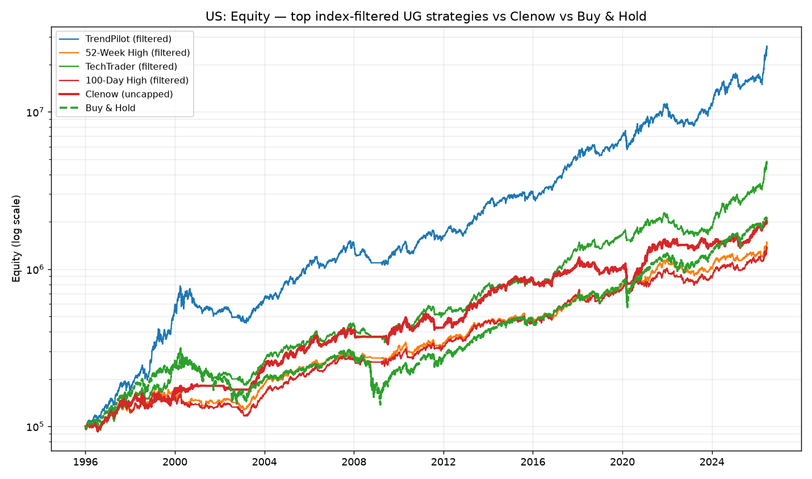
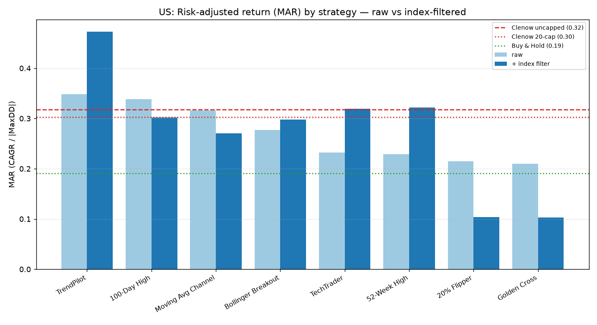
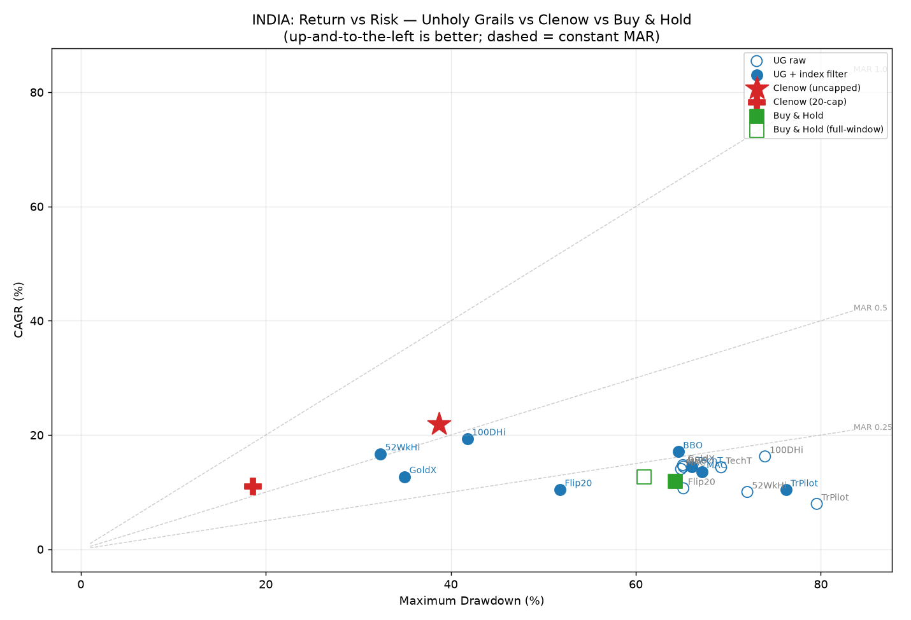
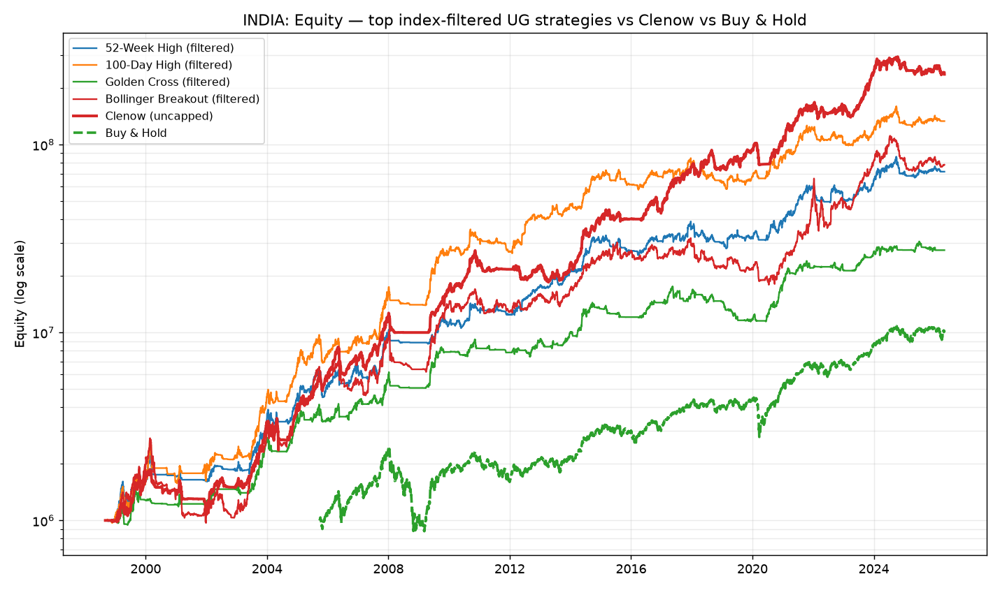
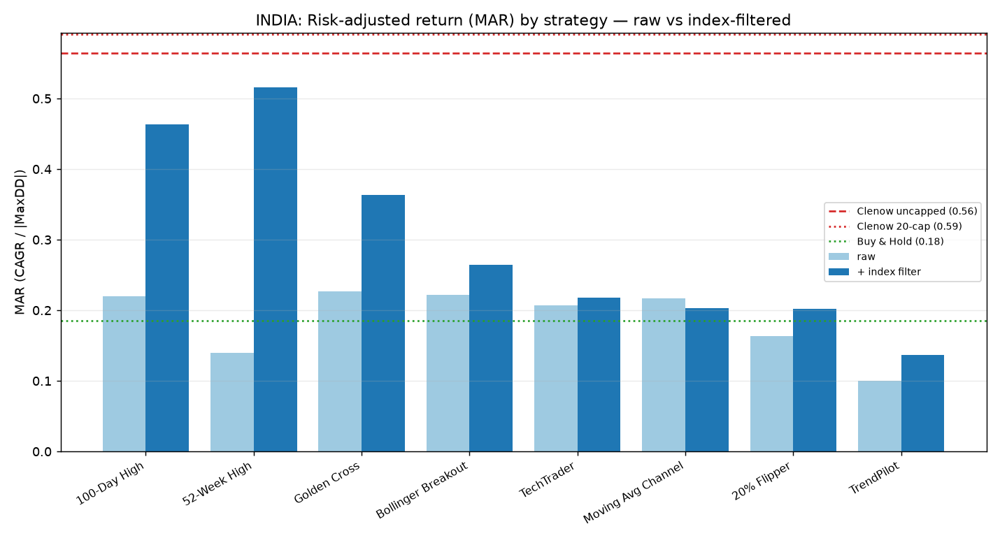

# Results: Unholy Grails vs Clenow

Auto-generated by `src/compare.py`. See [README.md](README.md) for the narrative.

## US — S&P 500 (TR) universe, strategies 1996-01-02 → 2026-06-16

Sorted by MAR (risk-adjusted return = CAGR / |MaxDD|). 'From' = the year each
row's scored series begins (note the India report benchmark only starts 2005).

| Strategy | From | CAGR | MaxDD | MAR | Sharpe | Exposure | AvgPos | Win% | Payoff | Trades |
|---|--:|--:|--:|--:|--:|--:|--:|--:|--:|--:|
| TrendPilot (filtered) | 1996 | 19.9% | -42.1% | 0.47 | 0.97 | 90.5% | 18.0 | 45.3% | 4.96 | 769 |
| TrendPilot (raw) | 1996 | 18.2% | -52.3% | 0.35 | 0.83 | 99.1% | 19.9 | 44.5% | 4.10 | 952 |
| 100-Day High (raw) | 1996 | 14.3% | -42.1% | 0.34 | 0.77 | 97.6% | 19.6 | 48.1% | 3.41 | 630 |
| 52-Week High (filtered) | 1996 | 9.2% | -28.5% | 0.32 | 0.72 | 81.0% | 16.1 | 47.5% | 2.32 | 1159 |
| TechTrader (filtered) | 1996 | 13.5% | -42.2% | 0.32 | 0.81 | 87.8% | 17.4 | 38.2% | 3.86 | 1054 |
| Clenow — book (uncapped) | 1996 | 10.3% | -32.5% | 0.32 | 0.65 | 81.3% | 21.8 | 48.7% | — | 3178 |
| Moving Avg Channel (raw) | 1996 | 13.9% | -44.2% | 0.32 | 0.75 | 98.0% | 19.7 | 47.3% | 2.38 | 1270 |
| Clenow — 20-position cap | 1996 | 7.6% | -25.0% | 0.30 | 0.60 | 65.0% | 16.3 | 47.9% | — | 2303 |
| 100-Day High (filtered) | 1996 | 8.9% | -29.4% | 0.30 | 0.68 | 82.4% | 16.4 | 45.8% | 2.28 | 1265 |
| Bollinger Breakout (filtered) | 1996 | 10.5% | -35.3% | 0.30 | 0.64 | 85.4% | 16.9 | 47.9% | 2.48 | 925 |
| Bollinger Breakout (raw) | 1996 | 12.3% | -44.4% | 0.28 | 0.70 | 93.5% | 18.7 | 48.9% | 2.38 | 1032 |
| Moving Avg Channel (filtered) | 1996 | 14.4% | -53.3% | 0.27 | 0.84 | 89.4% | 18.0 | 50.3% | 2.42 | 1153 |
| TechTrader (raw) | 1996 | 11.7% | -50.3% | 0.23 | 0.67 | 97.2% | 19.5 | 37.4% | 3.45 | 1310 |
| 52-Week High (raw) | 1996 | 10.4% | -45.4% | 0.23 | 0.56 | 97.1% | 19.5 | 45.2% | 6.49 | 248 |
| 20% Flipper (raw) | 1996 | 11.5% | -53.4% | 0.21 | 0.60 | 97.2% | 19.6 | 40.1% | 3.08 | 1114 |
| Golden Cross (raw) | 1996 | 9.3% | -44.5% | 0.21 | 0.53 | 96.0% | 19.2 | 43.3% | 3.10 | 795 |
| Buy & Hold — S&P 500 (TR) | 1996 | 10.5% | -55.3% | 0.19 | 0.55 | — | — | — | — | 0 |
| 20% Flipper (filtered) | 1996 | 4.1% | -39.2% | 0.10 | 0.27 | 73.6% | 14.6 | 38.1% | 1.98 | 1742 |
| Golden Cross (filtered) | 1996 | 3.7% | -35.7% | 0.10 | 0.35 | 52.2% | 10.4 | 44.0% | 1.78 | 2165 |

> **What is held constant vs not.** The comparison fixes the *data* (same
> survivorship-aware adjusted-OHLC panels and causal-repair), *costs*, *point-in-time
> universe* and *window* for every system. It does **not** equalise portfolio
> construction: Clenow's book profile is **uncapped** (it buys down the ranking until
> cash runs out — avg ~22 names US / ~31 India), ATR-volatility-sized, resized
> bi-weekly and fully compounding, whereas the Unholy Grails systems hold **≤20
> equal-weight single lots, no resizing** (the book's rules). The **Clenow — 20-position
> cap** row isolates signal quality from that diversification advantage. Unholy Grails
> also applies the book's liquidity floor (Clenow's book profile does not). Delisted
> names are liquidated at last traded price for **both** systems (the book's and Clenow's
> shared convention — an optimistic, no-haircut assumption).

## INDIA — Nifty 500 universe, strategies 1998-09-01 → 2026-04-30

Sorted by MAR (risk-adjusted return = CAGR / |MaxDD|). 'From' = the year each
row's scored series begins (note the India report benchmark only starts 2005). Prices use the **Clenow cleaning pipeline** (matched to the baseline bit-for-bit; see the data-quality note in the README — it is *less* aggressive than this repo's stricter `factor_repair`, so these India levels are a shared upper bound).

| Strategy | From | CAGR | MaxDD | MAR | Sharpe | Exposure | AvgPos | Win% | Payoff | Trades |
|---|--:|--:|--:|--:|--:|--:|--:|--:|--:|--:|
| Clenow — 20-position cap | 1998 | 11.0% | -18.6% | 0.59 | 1.11 | 38.7% | 15.6 | 47.7% | — | 2076 |
| Clenow — book (uncapped) | 1998 | 21.9% | -38.7% | 0.56 | 1.20 | 74.3% | 30.8 | 46.8% | — | 4541 |
| 52-Week High (filtered) | 1998 | 16.7% | -32.4% | 0.52 | 0.93 | 62.8% | 12.5 | 45.6% | 2.79 | 1236 |
| 100-Day High (filtered) | 1998 | 19.3% | -41.8% | 0.46 | 0.99 | 67.3% | 13.4 | 42.3% | 2.97 | 1395 |
| Golden Cross (filtered) | 1998 | 12.7% | -35.0% | 0.36 | 0.86 | 46.9% | 9.3 | 45.2% | 2.71 | 1272 |
| Bollinger Breakout (filtered) | 1998 | 17.1% | -64.6% | 0.26 | 0.72 | 79.9% | 15.7 | 44.6% | 2.83 | 802 |
| Golden Cross (raw) | 1998 | 14.7% | -65.1% | 0.23 | 0.63 | 91.8% | 18.1 | 38.2% | 3.92 | 719 |
| Bollinger Breakout (raw) | 1998 | 14.5% | -65.2% | 0.22 | 0.61 | 88.5% | 17.6 | 43.1% | 2.87 | 878 |
| 100-Day High (raw) | 1998 | 16.3% | -74.0% | 0.22 | 0.66 | 94.1% | 18.9 | 43.0% | 3.73 | 514 |
| TechTrader (filtered) | 1998 | 14.4% | -66.1% | 0.22 | 0.67 | 80.8% | 15.8 | 29.1% | 4.63 | 1180 |
| Moving Avg Channel (raw) | 1998 | 14.1% | -64.9% | 0.22 | 0.61 | 96.6% | 19.4 | 37.0% | 4.18 | 847 |
| Buy & Hold — Sensex (full window, price-only) | 1998 | 12.6% | -60.9% | 0.21 | 0.57 | — | — | — | — | 0 |
| TechTrader (raw) | 1998 | 14.4% | -69.2% | 0.21 | 0.65 | 89.7% | 17.6 | 30.7% | 4.35 | 1321 |
| Moving Avg Channel (filtered) | 1998 | 13.6% | -67.2% | 0.20 | 0.57 | 87.5% | 17.5 | 40.3% | 3.26 | 837 |
| 20% Flipper (filtered) | 1998 | 10.4% | -51.8% | 0.20 | 0.55 | 63.2% | 12.6 | 37.5% | 2.44 | 2025 |
| Buy & Hold — Nifty 500 | 2005 | 11.9% | -64.3% | 0.18 | 0.58 | — | — | — | — | 0 |
| 20% Flipper (raw) | 1998 | 10.7% | -65.1% | 0.16 | 0.42 | 95.0% | 19.0 | 34.0% | 2.64 | 2058 |
| 52-Week High (raw) | 1998 | 10.0% | -72.1% | 0.14 | 0.43 | 95.6% | 18.9 | 43.4% | 4.44 | 226 |
| TrendPilot (filtered) | 1998 | 10.4% | -76.2% | 0.14 | 0.43 | 88.0% | 17.2 | 33.6% | 3.59 | 842 |
| TrendPilot (raw) | 1998 | 8.0% | -79.6% | 0.10 | 0.30 | 97.6% | 19.6 | 32.3% | 3.80 | 1031 |

> **What is held constant vs not.** The comparison fixes the *data* (same
> survivorship-aware adjusted-OHLC panels and causal-repair), *costs*, *point-in-time
> universe* and *window* for every system. It does **not** equalise portfolio
> construction: Clenow's book profile is **uncapped** (it buys down the ranking until
> cash runs out — avg ~22 names US / ~31 India), ATR-volatility-sized, resized
> bi-weekly and fully compounding, whereas the Unholy Grails systems hold **≤20
> equal-weight single lots, no resizing** (the book's rules). The **Clenow — 20-position
> cap** row isolates signal quality from that diversification advantage. Unholy Grails
> also applies the book's liquidity floor (Clenow's book profile does not). Delisted
> names are liquidated at last traded price for **both** systems (the book's and Clenow's
> shared convention — an optimistic, no-haircut assumption).

